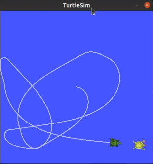

# Turtlesim-Catch-Them-All-project

## Project Description:

For this project, I used the Turtlesim package as a simulation tool to visualize the robot's behavior.

### Packages:

- **turtlesim_catch_them_all**: Contains the newly created nodes (a Python package).
- **turtlesim_interfaces**: Includes all interface definitions, including message and service types.
- **turtlesim_bringup**: Holds the launch file for starting the nodes application.

### Nodes Used:

1. `turtlesim_node` from the `turtlesim` package.
2. Custom node named `turtle_controller` to control the turtle named "turtle1" in `turtlesim_node`.
3. Custom node named `turtle_spawner` to spawn turtles and manage which turtle is still “alive”on the window.

### Functionalities:

* **The turtle_spawner node will have to:**
1. Call the /spawn service to create a new turtle (choose random coordinates between 0.0
and 11.0 for both x and y), and call the /kill service to remove a turtle from the screen.
Both those services are already advertised by the turtlesim_node.
2. Publish the list of currently alive turtles with coordinates on a topic /alive_turtles.
3. Handle a service server to “catch” a turtle, which means to call the /kill service and
remove the turtle from the array of alive turtles.

* **The turtle_controller node will have to:**
1. Run a control loop (for example using a timer with a high rate) to reach a given target
point. The first turtle on the screen “turtle1” will be the “master” turtle to control. To
control the turtle you can subscribe to /turtle1/pose and publish to /turtle1/cmd_vel.
2. The control loop will use a simplified P controller.
3. Subscribe to the /alive_turtles topic to get all current turtles with coordinates. From that
info, select a turtle to target (to catch).
4. When a turtle has been caught by the master turtle, call the service /catch_turtle
advertised by the turtle_spawner node.

## Installation:

Requires a ROS2 distribution (e.g., ROS2 Humble LTS).

1. Clone this repository in your ROS2 workspace.
2. Build the package (`colcon build --symlink-install`).

## Launching the Simulation:

Launch the simulation with:

```bash
ros2 launch turtlesim turtlesim_catch_them_all.launch.py
```
<p align="center">
  
</p>

## Developpment :
If you want to go further you can, for example:

- Make the new turtles move randomly. You will then need to be able to keep an eye on each turtle,
  and thus dynamically create a subscription for each alive turtle’s pose!
  For that you can create a “middle” node whose goal is to monitor the playground,
  and tell the turtle controller where to go at any given time.

- Change the pen color each time the “master turtle” has caught another turtle.
- Add another “master turtle” node to catch turtles even faster!
